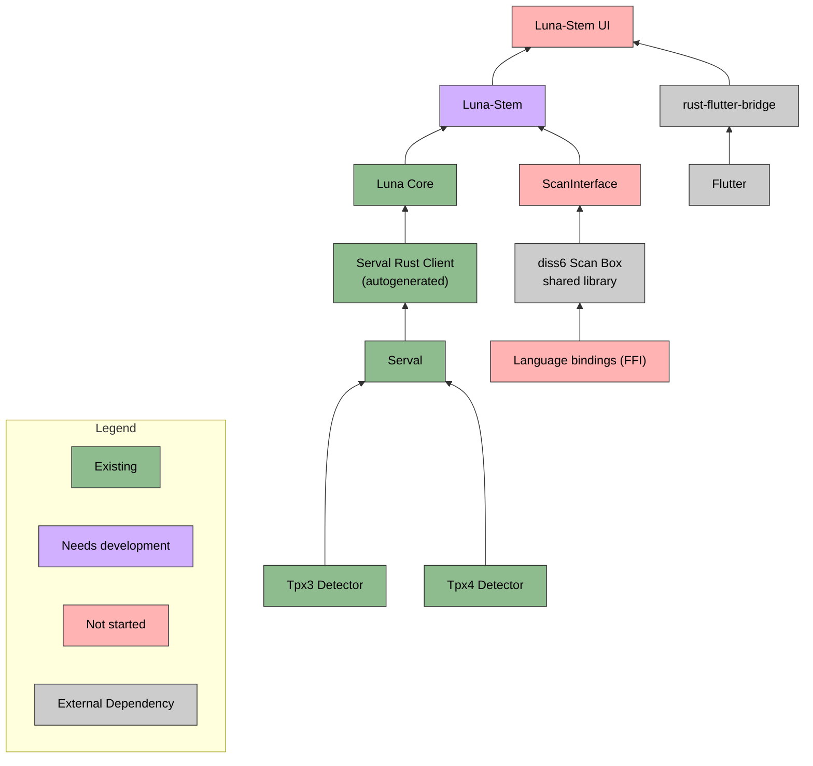

```mermaid
flowchart BT
    %% ─────────────  COMPONENTS ─────────────
    tpx3["Tpx3 Detector"]
    tpx4["Tpx4 Detector"]
    serval["Serval"]
    serval_rust_client["Serval Rust Client<br/>(autogenerated)"]
    lunacore["Luna Core"]
    lunastem["Luna-Stem"]
    stemui["Luna-Stem UI"]
    flutter["Flutter"]
    bridge["rust-flutter-bridge"]
    ffi["Language bindings (FFI)"]
    diss["diss6 Scan Box<br/>shared library"]
    scanif["ScanInterface"]

    %% ─────────────  DEPENDENCY ARROWS ─────────────
    tpx3 --> serval
    tpx4 --> serval
    serval --> serval_rust_client
    serval_rust_client --> lunacore
    lunacore --> lunastem
    lunastem --> stemui

    flutter --> bridge --> stemui

    ffi --> diss --> scanif --> lunastem

    %% ─────────────  COLOUR CLASSES ─────────────
    classDef green   fill:#8fbc8f,stroke:#333,color:#000
    classDef purple  fill:#d0b0ff,stroke:#333,color:#000
    classDef red     fill:#ffb3b3,stroke:#333,color:#000
    classDef external fill:#cccccc,stroke:#333,color:#000

    class tpx3,tpx4,serval,serval_rust_client,lunacore green
    class lunastem purple
    class stemui,ffi,scanif red
    class flutter,bridge,diss external

    %% ─────────────  LEGEND  ─────────────
    subgraph Legend[Legend]
      direction LR
      lg1[Existing]:::green
      lg2[Needs development]:::purple
      lg3[Not started]:::red
      lg4[External Dependency]:::external
    end

```

