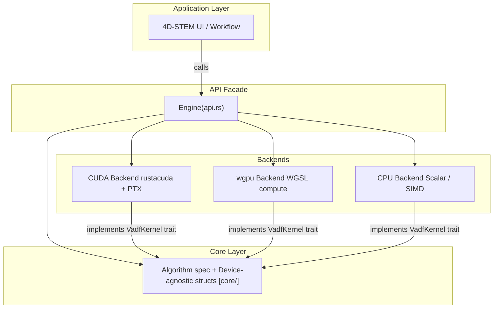

```mermaid

graph TD

%% ========= LAYERS =========

subgraph Application Layer

App[4D-STEM UI / Workflow]

end

  

subgraph API Facade

Engine["Engine(api.rs)"]

end

  

subgraph Core Layer

Core["Algorithm spec + Device-agnostic structs [core/]"]

end

  

subgraph Backends

CUDA["CUDA Backend rustacuda + PTX"]

WGPU["wgpu Backend WGSL compute"]

CPU["CPU Backend Scalar / SIMD"]

end

  

%% ========= RELATIONS =========

App -->|calls| Engine

Engine --> Core

Engine --> CUDA

Engine --> WGPU

Engine --> CPU

  

CUDA -- "implements VadfKernel trait" --> Core

WGPU -- "implements VadfKernel trait" --> Core

CPU -- "implements VadfKernel trait" --> Core
```

